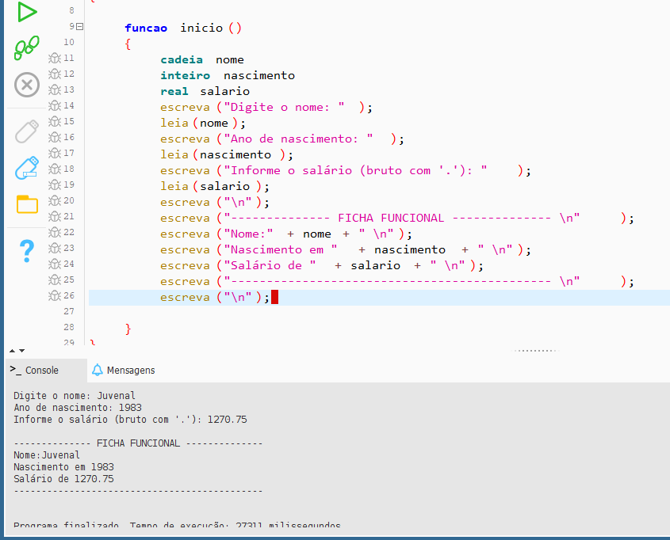
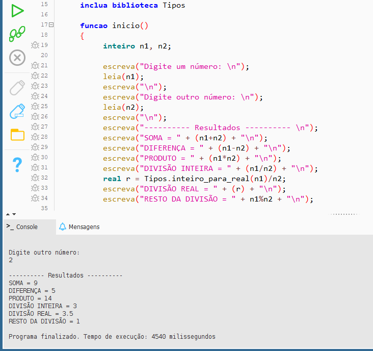
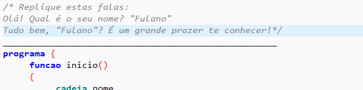
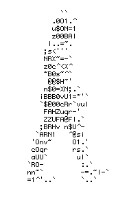

# Repositório público de exercícios em Algoritmos

🤔 Pseudolinguaguem permite o programador pensar no problema.

As tarefas a serem executadas ja estão dentro de cada arquivo em forma de comentário👨‍💻

 
 Estes são os primeiros passos de um programador!
 Assista a história das linguagens de programação com o Prof. Gustavo Guanabara:
 
 
